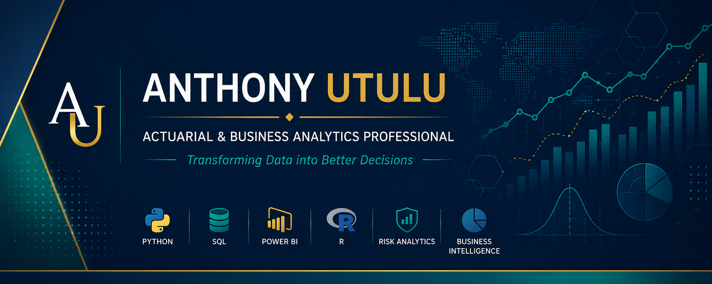

  

---

## About Me

I am an Actuarial & Business Analytics Professional passionate about transforming complex data into meaningful business insights.

With a strong academic foundation in Mathematics & Statistics and a Master's degree in Actuarial Science, I combine statistical thinking, business analytics and modern data tools to solve real-world problems across insurance, finance and business.

My work focuses on developing analytical solutions that support smarter decision-making, improve business performance and communicate complex information clearly to technical and non-technical audiences alike.

I believe analytics should do more than explain the past—it should help organisations make better decisions about the future.

---

## Areas of Expertise

- Actuarial Analytics
- Business Analytics
- Insurance Pricing
- Risk Modelling
- Predictive Analytics
- Statistical Modelling
- Business Intelligence
- Data Visualisation

---

## Technical Skills

### Languages

- Python
- SQL
- R

### Analytics

- Statistical Modelling
- Predictive Analytics
- Data Cleaning
- Exploratory Data Analysis

### Business Intelligence

- Power BI
- Microsoft Excel

---

## Featured Projects

🚧 Explore a selection of projects demonstrating actuarial modelling, business analytics, predictive analytics and decision-support solutions.

- Actuarial Claims Reserving
- Insurance Pricing Analytics
- IFRS 17 Analytics
- Mortality & Survival Analysis
- Pension Valuation
- Business Intelligence Dashboards

---

## Professional Mission

> To help organisations make confident, evidence-based decisions through actuarial thinking, business analytics and clear communication.

---

## Current Focus

- Building consulting-quality analytics projects
- Developing actuarial analytics solutions
- Creating executive Power BI dashboards
- Expanding expertise in business analytics and decision intelligence

---

## Connect With Me

📧 Email: utulu.an@gmail.com

💼 LinkedIn:
https://www.linkedin.com/in/utulu-an

🌍 GitHub:
https://github.com/Utulu1
